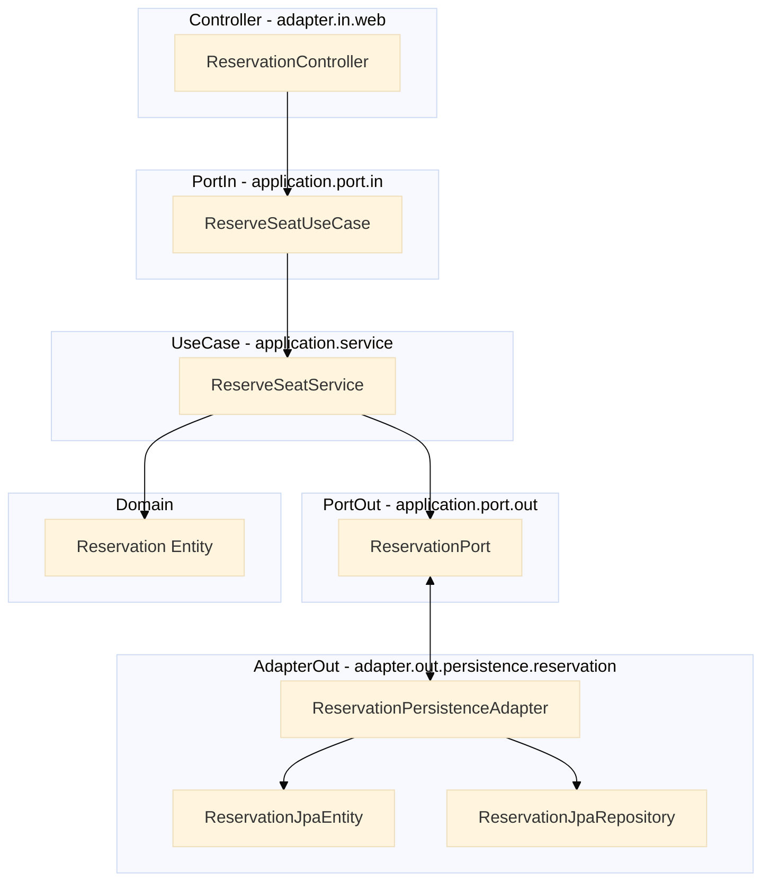

# 아키텍처 전략 (v0.1) - 레이어드 아키텍처

## 적용 원칙
- 복잡한 도메인 로직 / 외부 의존성이 많은 기능 → 클린 아키텍처
- 단순 조회/단일 책임 기능 → 레이어드 아키텍처

## 적용 계획
- 예약/결제 기능: 클린 아키텍처 적용
- 콘서트 조회, 포인트 충전 기능: 레이어드 아키텍처 적용

## 초기 디렉터리 구조 설계
```bash
🎵 concert/ 🎵
├── 📁 reservation (클린 아키텍처)
│   ├── 📂 domain
│   ├── 📂 application
│   ├── 📂 infrastructure
│   └── 📂 interface
├── 📁 concert (레이어드)
│   ├── 📂 controller
│   ├── 📂 service
│   └── 📂 repository
└── 📁 point (레이어드)
    ├── 📂 controller
    ├── 📂 service
    └── 📂 repository
```

# 아키텍처 전략 (v0.2) - 클린 아키텍처
> - 예약/결제 시스템 Clean Architecture
> - ☆★ Reservation 도메인 로직에 대해서
### 클린 아키텍처 디렉터리 구조 설계
```bash
com.example.reservation
├── domain
│   └── reservation
│       ├── Reservation.java            // 도메인 엔티티
│       └── ReservationStatus.java      // 예약 상태 enum
│
├── application
│   └── reservation
│       ├── port
│       │   ├── in
│       │   │   └── ReserveSeatUseCase.java       // 입력 포트
│       │   └── out
│       │       └── ReservationPort.java          // 출력 포트
│       └── service
│           └── ReserveSeatService.java           // 유스케이스 구현
│
├── adapter
│   ├── in
│   │   └── web
│   │       └── ReservationController.java        // API 컨트롤러
│   └── out
│       └── persistence
│           └── reservation
│               ├── ReservationJpaEntity.java
│               ├── ReservationJpaRepository.java
│               └── ReservationPersistenceAdapter.java
```
### 클린 아키텍처 설계 구성도
