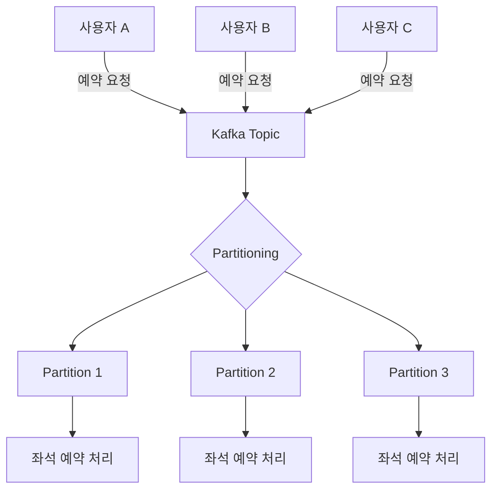

# 🦢 Redis와 Kafka를 활용한 동시성 이슈 해결
> 콘서트 예약 서비스 최적화
## 🦢 동시성 이슈 사례 예측
### 🦆 1. 예약 대기열 진입
#### ⒱ `같은 사용자가 동시`에 여러 번 대기열에 진입
#### ⒱ `여러 사용자가 동시`에 대기열에 진입
### 🦆 2. 좌석 점유
#### ⒱ `여러 사용자가 동시`에 같은 좌석을 예약하려고 시도
#### ⒱ 점유 TTL 미적용 시 `영구 점유` 가능성
### 🦆 3. 포인트 결제
#### ⒱ 두 개의 결제가 동시에 요청되어 잔액이 중복으로 차감되는 경우 (`중복 결제`)
### 🦆 4. 포인트 충전
#### ⒱ 충전 요청이 동시에 들어와 잔액이 중복으로 증가하는 경우 (`중복 충전`)

## 🦢 Redis 기반 분산락 - 3가지 방식 정리
### 🦆 1. Simple Lock
> 락을 걸고 TTL을 두어 자동 만료
### 🦆 2. Spin Lock
> 락 획득 실패 시 일정 시간 간격으로 재시도
### 🦆 3. Pub-Sub 기반 Lock
> - Redisson 등에서 제공하는 `락 해제 이벤트`를 `수신 대기 상태`로 대체
> - 락 해제 이벤트란, 락이 해제되었을 때 해당 이벤트를 수신하여 락 획득을 시도하는 방식

## 🦢 각 동시성 이슈 예측 사례를 방지하기 위한 해결 방법
### 🦆 대기열 진입 순서 관리
> #### **Redis ZSet** 을 사용하여 대기열 순서를 관리
> - Redis ZSet 이란, Redis에서 제공하는 `정렬된 집합 자료구조`로,
> - `점수(score)`를 사용하여 대기열 순서를 관리(정렬)한다.
> - Redis ZSet 은 `중복된 값을 허용하지 않기 때문`에, 같은 사용자의 대기열 `중복 진입을 방지`한다.
> - 다른 사용자가 동시에 대기열에 진입하더라도, 점수(score)를 기준으로 정렬되기 때문에 `순서대로 처리`된다.
> - 또한, `TTL`을 설정하여 일정 시간 후 자동으로 대기열에서 제거되도록 한다.
### 🦆 좌석 점유 동시성 제어
> #### **Redis Simple Lock** 또는 **Redisson** 을 사용하여 좌석 점유 동시성 제어
> - Redis Simple Lock 은 `락을 걸고 TTL을 두어 자동으로 만료`되도록 한다.
> - Redisson 은 Redis 기반의 분산 락 라이브러리로, `락 획득 실패 시 재시도`를 지원한다.
> - 이 방식은 `락 획득 실패 시 재시도`를 통해 동시성 문제를 해결한다.
> - 또한, `락 해제 이벤트`를 수신 대기 상태로 대체하여 락 해제를 기다리는 방식도 고려할 수 있다.

### 🦆 포인트 결제 충돌 방지
> #### **Redis Lock** + **DB 트랜잭션** 을 사용하여 포인트 결제 충돌 방지
> - Redis Lock 을 사용하여 결제 요청 시 `락을 획득`한다.
> - 락을 획득한 후, DB 트랜잭션을 사용하여 결제 처리를 수행한다.

### 🦆 예약 완료 이벤트 처리
> #### **Kafka** 를 사용하여 예약 완료 이벤트 처리
> - Kafka 는 `메시지 큐 시스템`으로, `이벤트 기반 처리`를 지원한다.
> - `좌석 ID`를 기준으로 `Partitioning`을 적용하여, 같은 좌석에 대한 이벤트는 순차적으로 처리되도록 한다.

## 🦢 Kafka Partition 기반 순차 처리 – 도식화

## **💬 자가진단** : 트랜잭션보다 락을 먼저 잡아야 하는 이유
> - 내가 이해한 바로는 `트랜잭션`이란, 결국 `락을 제어하기 위한 수단`이다.
> - 태초에 컴퓨터 시스템이 동시성을 제어하기 위한 수단은 `락`이었고,
> - 이 때 `트랜잭션`이란, `하나의 락을 획득한 후에 수행되는 일련의 작업`이다.
> - 즉, `락의 범위`를 지정하는 것이 트랜잭션의 역할이다. `여러 락 작업을 하나`로 묶어주는 역할을 한다.
> - 이에 따라, 하나의 락 범위인 트랜잭션이 실패했을 때, `롤백 작업`을 하는 것도 트랜잭션의 역할이다.