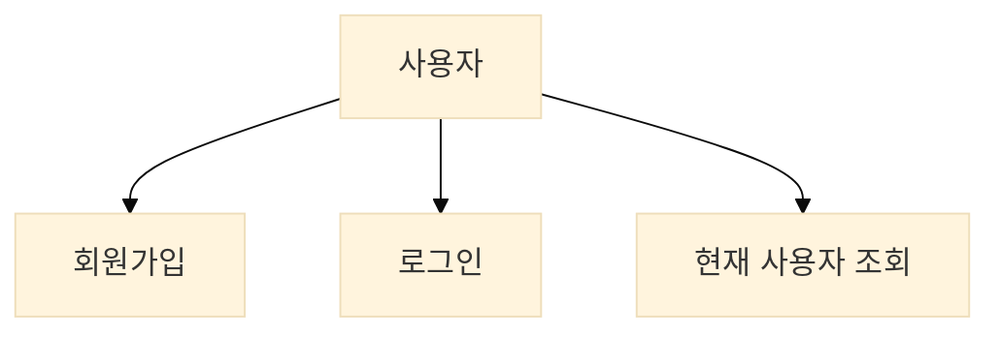
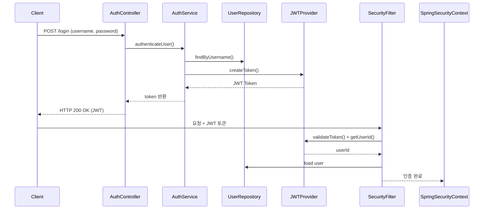
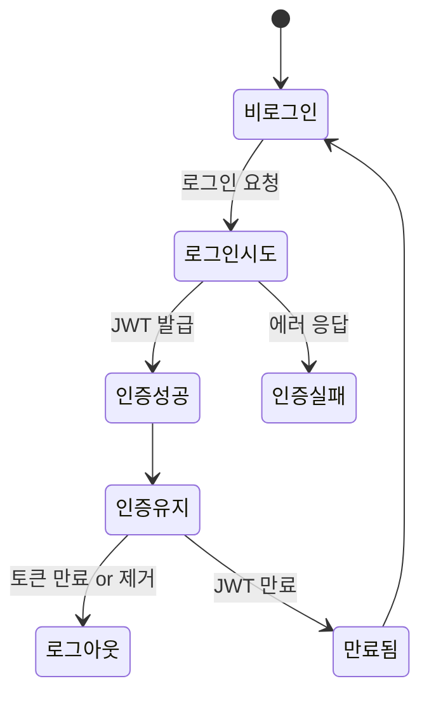
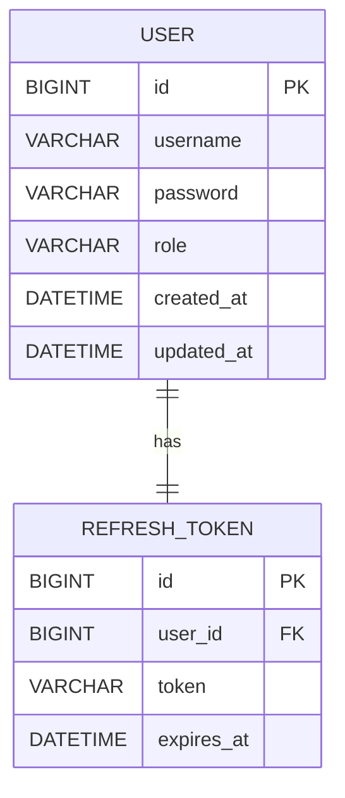

# 🎵 사용자 인증 흐름 🎵

## 1. 서비스 비즈니스 흐름
```bash
[회원가입] → [로그인 요청] → [JWT 발급] → [JWT 인증 헤더로 API 호출] → [SecurityContext에 사용자 정보 저장]  
[JWT 만료] → [재로그인 요청]
```

## 2. 유스케이스 (Use Cases)

### UseCase: signUp(SignUpRequest)
- username/email, password, nickname 등으로 회원가입
- 중복 여부 확인
- 비밀번호 암호화 (BCrypt 등)
- DB 저장

### UseCase: login(LoginRequest)
- username + password 입력
- 사용자 존재 여부 확인
- 비밀번호 검증
- JWT AccessToken + (선택) RefreshToken 발급

### UseCase: getCurrentUser()
- Request Header에서 JWT 추출
- JWT → UserId 복호화
- 해당 ID로 사용자 조회
- SecurityContextHolder.getContext().getAuthentication() 통해 접근

## 3. 시퀀스 다이어그램 (Spring Security + JWT 구성 흐름)


## 4. 상태 다이어그램 (인증 상태)


## 5. 테이블 정의

### User Table
| 컬럼명         | 타입           | 제약조건           | 설명             |
|-------------|--------------|----------------|----------------|
| id          | BIGINT       | PK, AUTO       | 사용자 ID         |
| username    | VARCHAR(50)  | UNIQUE         | 로그인 ID         |
| password    | VARCHAR(100) | NOT NULL       | 해싱된 비밀번호       |
| role        | VARCHAR(20)  | DEFAULT 'USER' | 권한: USER/ADMIN |
| created\_at | DATETIME     | DEFAULT now()  | 생성일            |
| updated\_at | DATETIME     | DEFAULT now()  | 수정일            |

## 5. ERD (User + JWT 중심)
