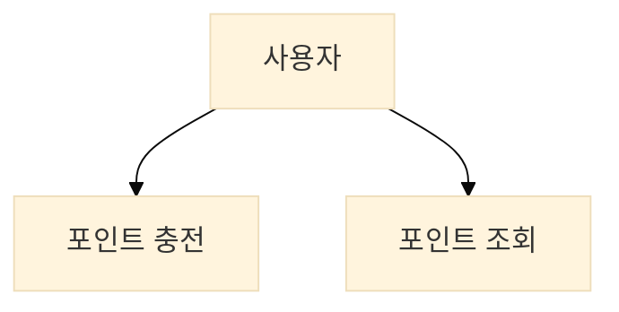
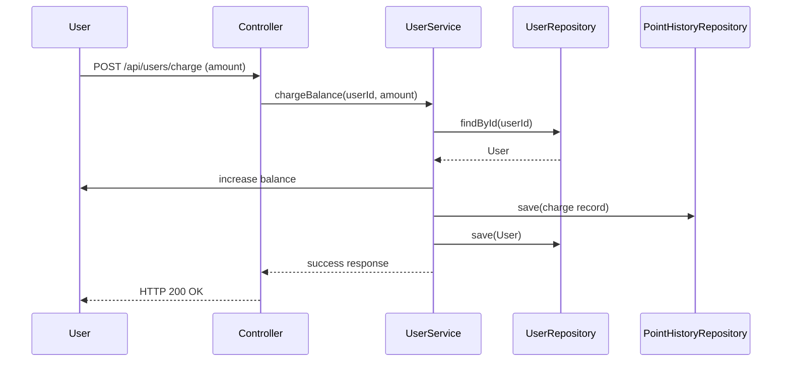
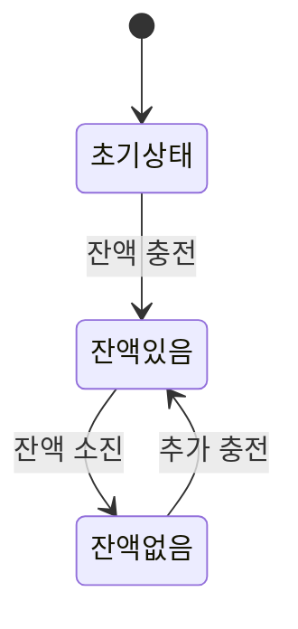
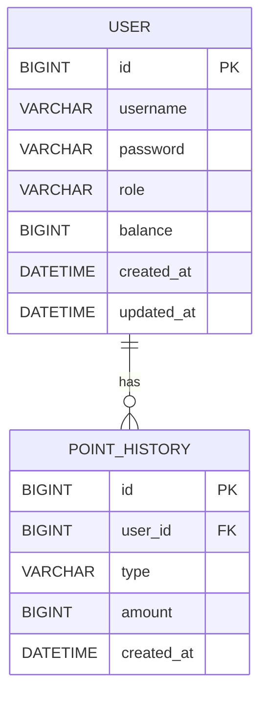

# 🎵 포인트 충전 기능 🎵

## 1. 서비스 비즈니스 흐름
- 사용자는 금액처럼 사용이 가능한 포인트를 충전하거나 사용한다.
- 포인트를 충전/사용에 대한 히스토리를 기록한다.
```bash
[회원 사용자] → [잔액 충전 요청] → [잔액 증가] → [충전 기록 저장]  
                                        ↓  
                              [잔액 조회 요청] → [현재 잔액 반환]
```

## 2. 유스케이스 다이어그램 (포인트 충전)

### UseCase: chargeBalance(userId, amount)
###### 시나리오 흐름
- 사용자가 충전할 금액을 입력하고 요청을 보낸다.
- 서버는 사용자 ID에 해당하는 사용자 엔티티를 조회한다.
- 잔액(balance)을 증가시키고 충전 이력을 기록한다.
- 저장 후 성공 메시지를 반환한다.

### UseCase: getBalance(userId)
###### 시나리오 흐름
- 사용자가 자신의 잔액을 조회한다.
- 서버는 사용자 ID에 해당하는 사용자 정보를 조회한다.
- 사용자 객체에 포함된 현재 잔액을 반환한다.

## 3. 시퀀스 다이어그램


## 4. 상태 다이어그램 (콘서트 상태 전이)


## 5. 테이블 정의

### User Table
| 컬럼명         | 타입           | 제약조건             | 설명        |
|-------------|--------------|------------------|-----------|
| id          | BIGINT       | PK, AUTO         | 사용자 고유 ID |
| username    | VARCHAR(50)  | UNIQUE, NOT NULL | 사용자 ID    |
| password    | VARCHAR(100) | NOT NULL         | 비밀번호      |
| role        | VARCHAR(20)  | NOT NULL         | 사용자 권한    |
| balance     | BIGINT       | DEFAULT 0        | 현재 포인트 잔액 |
| created\_at | DATETIME     | NOT NULL         | 생성일       |
| updated\_at | DATETIME     | NOT NULL         | 수정일       |

### Point History Table
| 컬럼명         | 타입          | 제약조건          | 설명          |
|-------------|-------------|---------------|-------------|
| id          | BIGINT      | PK, AUTO      | 충전 기록 고유 ID |
| user\_id    | BIGINT      | FK            | 사용자 ID (참조) |
| type        | VARCHAR(10) | NOT NULL      | 충전/차감       |
| amount      | BIGINT      | NOT NULL      | 금액          |
| created\_at | DATETIME    | DEFAULT now() | 기록 생성 시각    |

## 5. ERD
