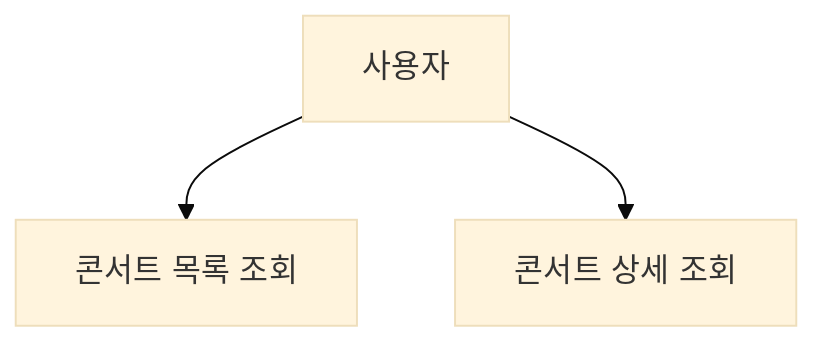
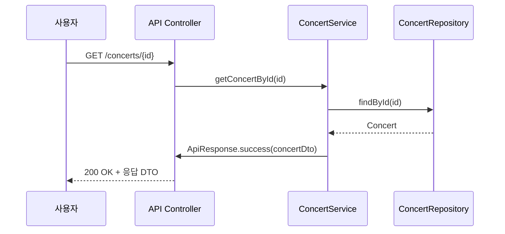
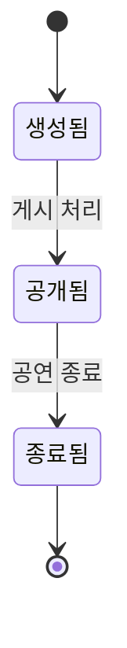
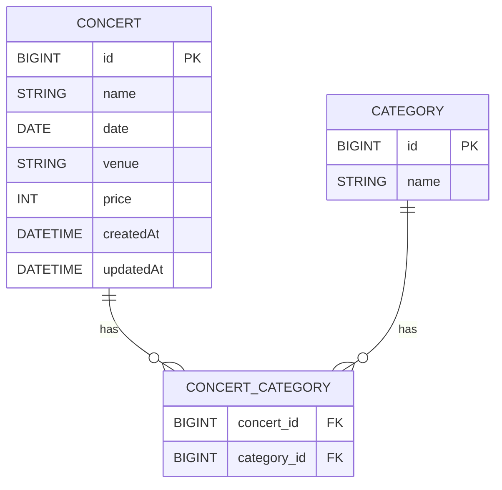

# 🎵 콘서트 조회 기능 🎵

## 1. 서비스 비즈니스 흐름
- 사용자는 콘서트 목록을 조회한다.
- 콘서트는 이름, 날짜, 좌석 수 정보를 포함한다.

## 2. 유스케이스 다이어그램 (콘서트 조회)

## 3. 시퀀스 다이어그램 (콘서트 상세 조회)

## 4. 상태 다이어그램 (콘서트 상태 전이)

## 5. 테이블 정의

### Concert Table
| 컬럼명         | 타입           | 제약조건           | 설명       |
|-------------|--------------|----------------|----------|
| id          | BIGINT       | PK, Auto       | 콘서트 ID   |
| name        | VARCHAR(255) | NOT NULL       | 콘서트 제목   |
| date        | DATETIME     | NOT NULL       | 콘서트 일시   |
| venue       | VARCHAR(255) | NOT NULL       | 공연 장소    |
| price       | INT          | NOT NULL       | 기본 티켓 가격 |
| created\_at | DATETIME     | DEFAULT now()  | 생성 시각    |
| updated\_at | DATETIME     |                | 수정 시각    |

### CATEGORY Table
| 컬럼명  | 타입           | 제약조건           | 설명      |
|------|--------------|----------------|---------|
| id   | BIGINT       | PK, Auto       | 카테고리 ID |
| name | VARCHAR(255) | NOT NULL       | 카테고리 명  |

### Concert-Category Relation Table
| 컬럼명         | 타입     | 제약조건 | 설명      |
|-------------|--------|------|---------|
| concert_id  | BIGINT | FK   | 콘서트 ID  |
| category_id | BIGINT | FK   | 카테고리 ID |

## 5. ERD
