# 🐻 RedisQueueAdapter 기반 대기열 시스템의 핵심 흐름

## 🧸 토큰 발급 시퀀스 다이어그램 (issueToken)

## 🧸 상태 조회 시퀀스 다이어그램 (getStatus)

```mermaid
sequenceDiagram
    participant User
    participant QueueAdapter
    participant Redis

    User->>QueueAdapter: getStatus(token)
    QueueAdapter->>Redis: HGET concert:token:{uuid} userId
    alt token 존재
        QueueAdapter->>Redis: ZRANK concert:queue userId
        QueueAdapter->>Redis: ZCARD concert:queue
        QueueAdapter-->>User: QueueStatus(position, totalUsers, estimatedWaitTime)
    else token 없음
        QueueAdapter-->>User: Optional.empty()
    end
```

## 🧸 Redis 데이터 구조 (ER 다이어그램 스타일)

## 🧸 시스템 흐름 상태도

```mermaid
stateDiagram-v2
    [*] --> IssueToken : 대기 요청

    IssueToken --> TokenIssued : Redis에 저장
    TokenIssued --> Waiting : 대기열 진입 완료

    Waiting --> GetStatus : 상태 조회
    Waiting --> RemoveToken : 예매 완료 또는 포기
    GetStatus --> Waiting

    Waiting --> Expired : TTL 만료
    RemoveToken --> [*]
    Expired --> [*]
```
