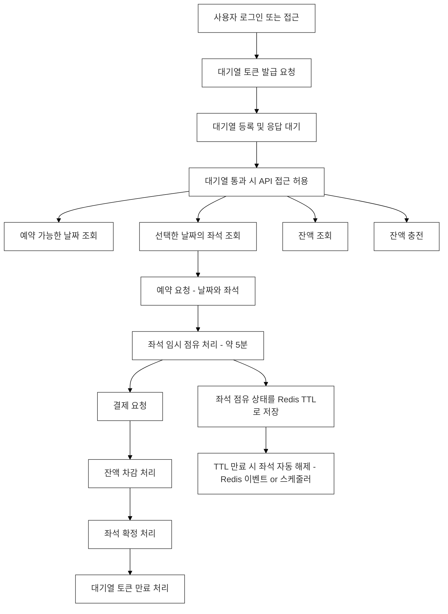
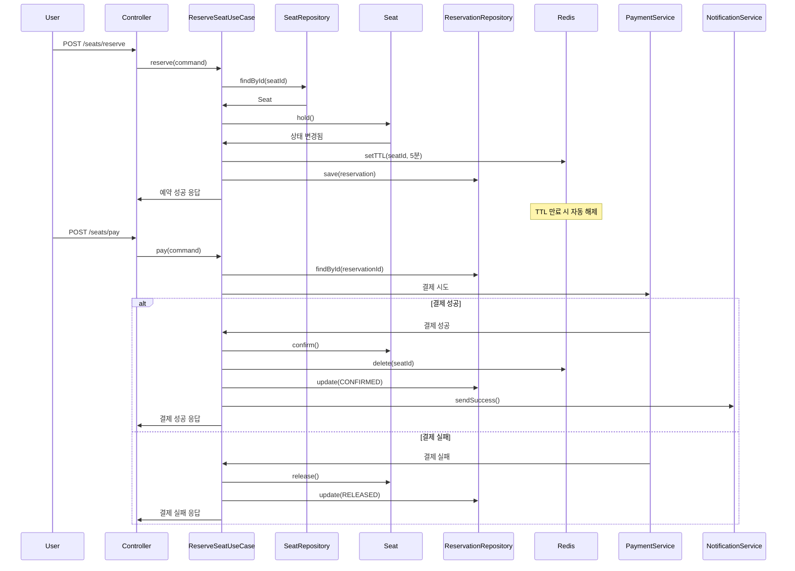
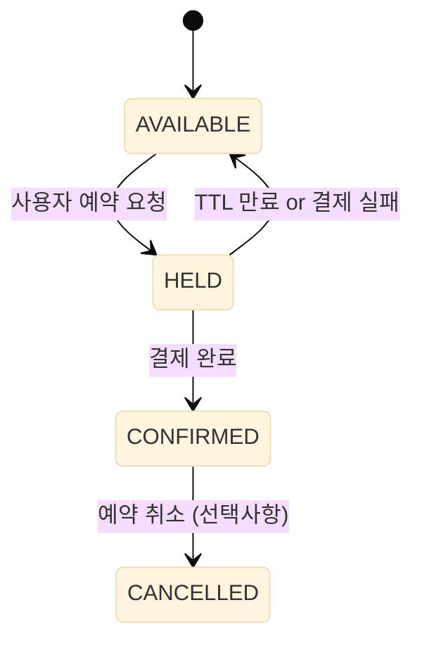
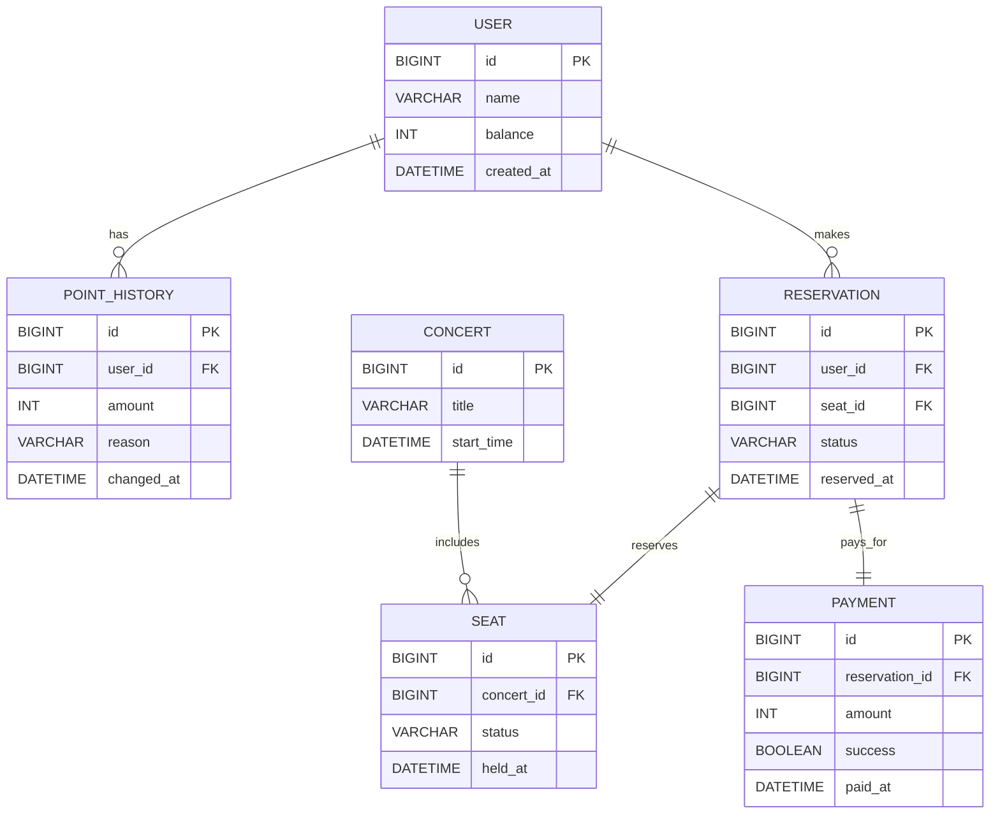

# 🎵 콘서트 좌석 예약/결제 서비스 설계 문서 🎵

## 1. 서비스 비즈니스 흐름
```bash
[사용자]
   ↓ 예약 요청 (좌석ID, 사용자ID, 금액)
[ReserveAndPayUseCase]
   ↓ 좌석 예약 가능 여부 확인
[Seat Entity]
   ↓ 좌석 임시 점유 (hold)
[ReservationRepository]
   ↓ 임시 예약 저장 (예약 엔티티 생성)
[PaymentService]
   ↓ 결제 시도
   ├─ 성공 → [Seat Entity] 좌석 상태 확정 (confirm)
   └─ 실패 → [Seat Entity] 좌석 상태 복구 (release)
[ReservationRepository]
   ↓ 예약 확정 저장 또는 상태 롤백
[NotificationPublisher]
   ↓ 예약 완료 알림 전송
```

## 2. 유스케이스 다이어그램 (콘서트 좌석 예약/결제)


## 3. 시퀀스 다이어그램 (콘서트 좌석 예약/결제)


## 4. 상태 다이어그램 (콘서트 좌석 예약/결제 상태 전이)


## 5. 테이블 정의

### SEAT Table
| 컬럼명         | 타입         | 설명                                |
|-------------|------------|-----------------------------------|
| id          | BIGINT(PK) | 좌석 ID (1\~50 등)                   |
| concert\_id | BIGINT     | 콘서트 ID (공연 정보)                    |
| status      | VARCHAR    | 상태 (AVAILABLE, HELD, CONFIRMED 등) |
| held\_at    | DATETIME   | 점유 시작 시간                          |

### RESERVATION Table
| 컬럼명          | 타입         | 설명                                   |
|--------------|------------|--------------------------------------|
| id           | BIGINT(PK) | 예약 ID                                |
| user\_id     | BIGINT     | 예약한 사용자 ID                           |
| seat\_id     | BIGINT     | 예약한 좌석 ID                            |
| status       | VARCHAR    | 예약 상태 (HELD, CONFIRMED, CANCELLED 등) |
| reserved\_at | DATETIME   | 예약 일시                                |
> #### 예약 상태 값 ENUM (ReservationStatus)
> - HELD: 임시 점유 중
> - CONFIRMED: 결제 완료 및 확정
> - RELEASED or CANCELLED: 실패 또는 만료

### PAYMENT Table
| 컬럼명         | 타입     | 제약조건 | 설명      |
|-------------|--------|------|---------|
| concert_id  | BIGINT | FK   | 콘서트 ID  |
| category_id | BIGINT | FK   | 카테고리 ID |

## 5. ERD
