# 🎵 콘서트 조회 기능 🎵

## 1. 서비스 비즈니스 흐름
- 사용자는 콘서트 목록을 조회한다.
- 콘서트는 이름, 날짜, 좌석 수 정보를 포함한다.

## 2. 유스케이스 다이어그램 (콘서트 조회)

```mermaid
%%{init: {'theme': 'base'}}%%
flowchart TD
    User[사용자] --> UC1[콘서트 목록 조회]
    User --> UC2[콘서트 상세 조회]
    Admin[관리자] --> UC1
    Admin --> UC2
```

## 3. 시퀀스 다이어그램 (콘서트 상세 조회)

```mermaid
sequenceDiagram
    participant 사용자
    participant API as API Controller
    participant Service as ConcertService
    participant Repo as ConcertRepository

    사용자->>API: GET /concerts/{id}
    API->>Service: getConcertById(id)
    Service->>Repo: findById(id)
    Repo-->>Service: Concert
    Service->>API: ApiResponse.success(concertDto)
    API-->>사용자: 200 OK + 응답 DTO
```

## 4. 상태 다이어그램 (콘서트 상태 전이)

```mermaid
stateDiagram-v2
    [*] --> 생성됨
    생성됨 --> 공개됨: 게시 처리
    공개됨 --> 종료됨: 공연 종료
    종료됨 --> [*]
```
