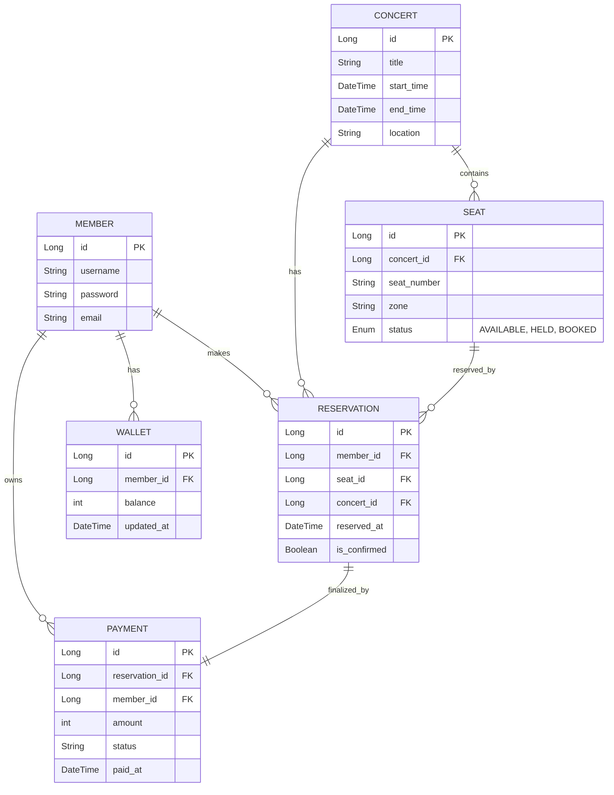

## ERD - 콘서트 예약 서비스

## 🍁 테이블 정보 🍁
#### MEMBER - 사용자 정보
- id: 사용자 고유 ID
- username: 로그인용 아이디
- password: 비밀번호 (암호화 저장)
- email: 이메일 주소

#### CONCERT – 콘서트 정보
- id: 콘서트 고유 ID
- title: 콘서트 제목
- start_time / end_time: 공연 시작/종료 시간
- location: 공연 장소

#### SEAT – 좌석 정보
- id: 좌석 고유 ID
- concert_id: 어떤 콘서트의 좌석인지 연결
- seat_number: A1, B5 같은 좌석 번호
- zone: 구역 (VIP, R석 등)
- status: 현재 상태 (AVAILABLE, HELD, BOOKED)

#### RESERVATION – 좌석 예약 내역
- id: 예약 고유 ID
- member_id: 누가 예약했는지
- seat_id: 어떤 좌석을 예약했는지
- concert_id: 어떤 콘서트인지
- reserved_at: 예약한 시간
- is_confirmed: 결제되어 확정된 상태인지 여부

#### PAYMENT – 결제 정보
- id: 결제 고유 ID
- reservation_id: 어떤 예약에 대한 결제인지
- member_id: 누가 결제했는지
- amount: 결제 금액
- status: 상태 (예: 성공, 실패)
- paid_at: 결제 완료 시간

#### WALLET – 사용자 잔액 정보
- id: 지갑 고유 ID
- member_id: 어떤 사용자의 지갑인지
- balance: 현재 잔액
- updated_at: 마지막 잔액 변경 시간

## 🍁 관계 정보 🍁
| 관계                              | 의미                                                            | 예시                      |
| ------------------------------- | ------------------------------------------------------------- | ----------------------- |
| `MEMBER` **1\:N** `RESERVATION` | 한 명이 여러 좌석 예약 가능                                              | 유저 A가 A1, A2 좌석 예약      |
| `MEMBER` **1\:N** `PAYMENT`     | 한 명이 여러 번 결제 가능                                               | 유저 B가 2번 결제함            |
| `MEMBER` **1:1** `WALLET`       | 유저는 지갑을 하나 가짐                                                 | 유저 C의 잔액: 10,000원       |
| `CONCERT` **1\:N** `SEAT`       | 한 콘서트에 여러 좌석                                                  | 콘서트 X에 500석             |
| `SEAT` **1\:N** `RESERVATION`   | 하나의 좌석이 여러 번 예약될 수 있음  (※ 중복 예약은 불가지만, 이력 저장을 위한 설계 고려 가능) | A1 좌석이 과거에 예약됨 → 다시 예약됨 |
| `RESERVATION` **1:1** `PAYMENT` | 하나의 예약은 하나의 결제와 연결됨                                           | 예약 #1 → 결제 #3 연결        |