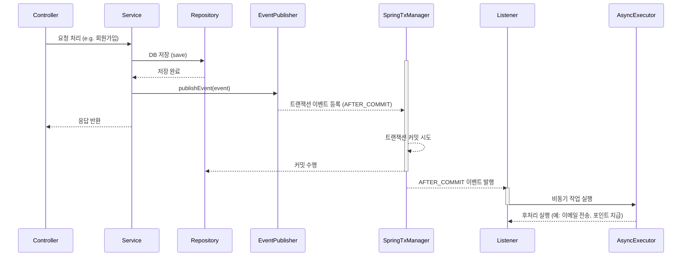

# 📰 Event-Driven Architecture

### 🗞️ 1. `ApplicationEventPublisher` 를 사용해 이벤트를 발행한다.
```java
/**
 * `Spring` 에서 `이벤트를 발행`하는 컴포넌트
 * 커스텀 이벤트를 생성하여 특정 로직을 느슨하게 연결하거나
 * (이벤트 드리븐 설계에 착안하여) 비동기 또는 후처리용으로 분리할 수 있다.
 */
@Component
@RequiredArgsConstructor
public class UserService {
    private final ApplicationEventPublisher publisher;

    public void registerUser(User user) {
        userRepository.save(user);
        publisher.publishEvent(new UserRegisteredEvent(user.getId()));
    }
}
```
```java
/**
 * 커스텀 이벤트 객체 예시
 * (최신 Spring 기준) 순수한 POJO 객체로 정의
 * POJO 란, Plain Old Java Object 의 약자로 순수 Java 로만 작성된 객체를 일컫는다.
 */
public class UserRegisteredEvent {

    private final Long userId;

    public UserRegisteredEvent(Long userId) {
        this.userId = userId;
    }

    public Long getUserId() {
        return userId;
    }
}
```
### 🗞️ 2. `@TransactionalEventListener` 를 사용해 트랜잭션 커밋 후 이벤트를 처리한다.
- AFTER_COMMIT 시점에 처리된다.
```java
/**
 * 인자로 주어진 `UserRegisteredEvent` 가 발행되면
 * 해당 UserRegisterEvent 가 포함된 트랜잭션이 커밋된 후(AFTER_COMMIT)에 실행된다.
 * 그리고 @Async 가 붙어 있다면, `별도 스레드`에서 `비동기적으로 실행`된다.
 */
@Component
public class AsyncMailSender {

    @Async
    @TransactionalEventListener(phase = TransactionPhase.AFTER_COMMIT)
    public void sendWelcomeMail(UserRegisteredEvent event) {
        // 트랜잭션 커밋 후에만 실행됨
    }
}
```