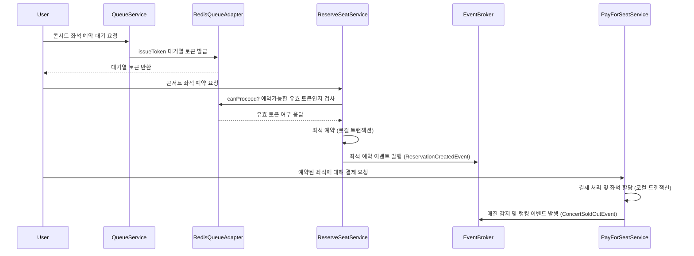

# 📰 Event-Driven Architecture
## 🗞️ 서비스 간 이벤트 발행 & 구독 흐름도

```mermaid
sequenceDiagram
    participant User
    participant QueueService
    participant RedisQueueAdapter
    participant ReserveSeatService
    participant EventBroker
    participant PayForSeatService
    
    User->>QueueService: 콘서트 좌석 예약 대기 요청
    QueueService->>RedisQueueAdapter: issueToken 대기열 토큰 발급
    RedisQueueAdapter-->>User: 대기열 토큰 반환
    
    User->>ReserveSeatService: 콘서트 좌석 예약 요청
    ReserveSeatService->>RedisQueueAdapter: canProceed? 예약가능한 유효 토큰인지 검사
    RedisQueueAdapter-->>ReserveSeatService: 유효 토큰 여부 응답
    ReserveSeatService->>ReserveSeatService: 좌석 예약 (로컬 트랜잭션)
    ReserveSeatService->>EventBroker: 좌석 예약 이벤트 발행 (ReservationCreatedEvent)
    
    User->>PayForSeatService: 예약된 좌석에 대해 결제 요청
    PayForSeatService->>PayForSeatService: 결제 처리 및 좌석 할당 (로컬 트랜잭션)
    PayForSeatService->>EventBroker: 매진 감지 및 랭킹 이벤트 발행 (ConcertSoldOutEvent)
```