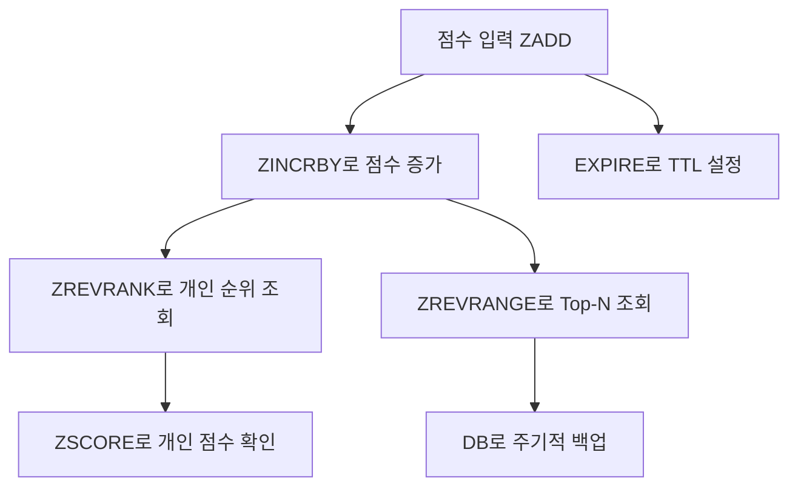

# 🏅 레디스 랭킹 시스템

## 🥇 사용할 자료구조
| 요소          | 설명                        |
|-------------|---------------------------|
| `ZADD`      | 점수와 함께 유저 추가 또는 갱신        |
| `ZREVRANGE` | 높은 점수 순으로 Top-N 조회        |
| `ZREVRANK`  | 개인 순위 확인 (0부터 시작)         |
| `EXPIRE`    | TTL 설정 (일간/주간 랭킹 자동 초기화용) |

## 🥇 랭킹 시스템 구현
### 🥈 키 설계 전략
| 랭킹 종류 | 키 예시                     | 설명                |
|-------|--------------------------|-------------------|
| 일간 랭킹 | `ranking:daily:20250704` | 날짜별 랭킹 (YYYYMMDD) |
| 주간 랭킹 | `ranking:weekly:202527`  | 주차별 랭킹 (YYYYWW)   |

### 🥈 유저 점수 추가 (ZADD)
```bash
ZADD ranking:daily:20250704 1500 "user:123"
ZINCRBY ranking:daily:20250704 200 "user:123"
```

### 🥈 Top-N 랭킹 조회
```bash
ZREVRANGE ranking:daily:20250704 0 9 WITHSCORES
```

### 🥈 내 순위 확인
```bash
ZREVRANK ranking:daily:20250704 "user:123"
ZSCORE ranking:daily:20250704 "user:123"
```

### 🥈 TTL 만료 전략
```bash
EXPIRE ranking:daily:20250704 86400   # 24시간
EXPIRE ranking:weekly:202527 604800  # 7일
```
## 🥇 한눈에 워크플로우 


