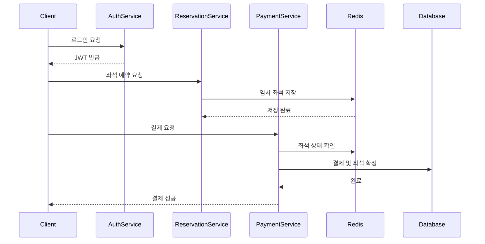
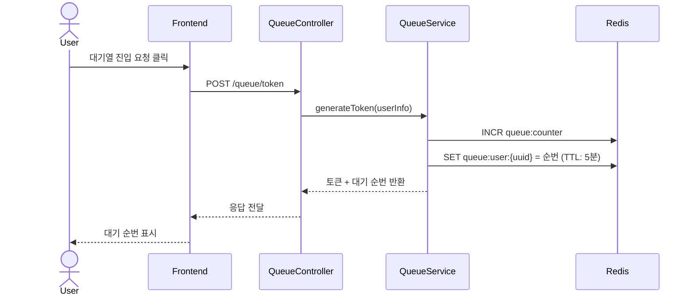
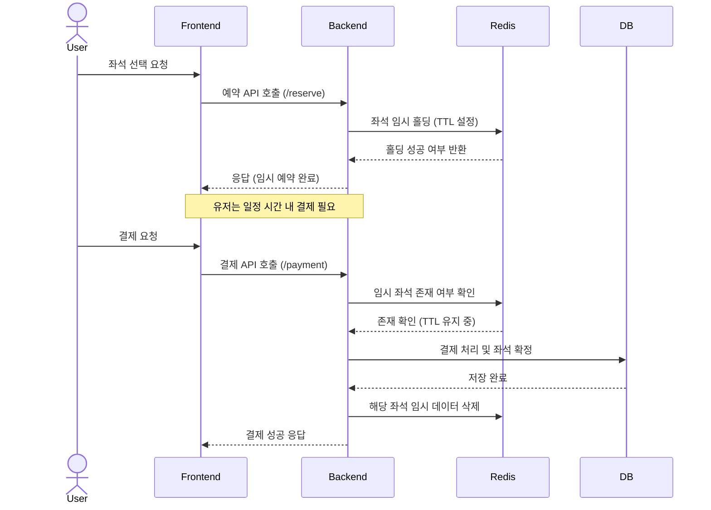

## 유저 플로우 (요약 초안)

1. 유저는 토큰 발급 API를 통해 대기열에 진입합니다.
2. 대기열 순서에 따라 서비스 이용 권한을 획득합니다.
3. 좌석 정보를 조회하고, 원하는 좌석을 임시 예약합니다.
4. 유저는 잔액을 충전한 뒤 결제합니다.
5. 결제가 완료되면 좌석은 해당 유저에게 최종 배정됩니다.

## 🍁 전체 로직 시퀀스 다이어그램 🍁

## 🍁 주요 API 시퀀스 다이어그램 🍁

#### 대기열 토큰 발급 API

#### 좌석 임시 예약 + 결제 API

