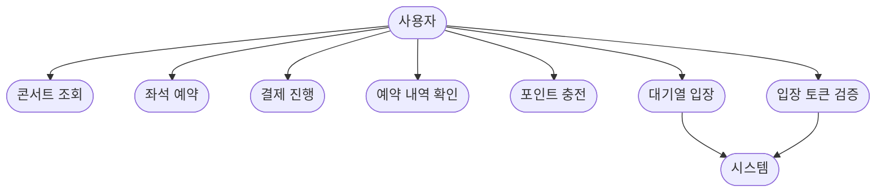

# 🎵 concert 서비스 비즈니스 흐름 (초안) 🎵

## 1. 콘서트 조회
- 사용자는 콘서트 목록을 조회한다.
- 콘서트는 이름, 날짜, 좌석 수 정보를 포함한다.

## 2. 예약/결제
1. 사용자가 좌석을 선택한다.
2. 시스템은 좌석을 점유 상태로 변경한다.
3. 사용자가 결제한다.
4. 결제가 완료되면 좌석을 확정한다.
5. 결제가 실패하면 좌석 점유를 해제한다.

## 3. 포인트 충전
- 사용자가 원하는 금액만큼 포인트를 충전한다.
- 포인트는 결제에 사용된다.

# 🎵 concert 서비스 기능 단위별 유스-케이스 🎵

